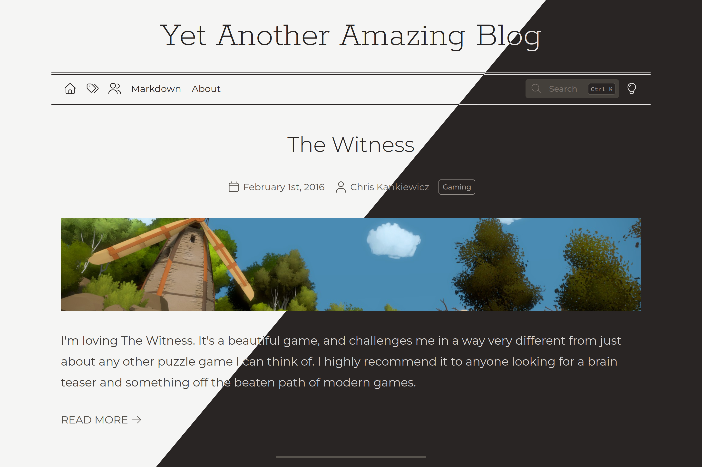

    

    
    
    
     
    
    
    

---

Plume is your self-hosted, Markdown based publishing platform.

All posts (and pages) authored in Markdown, stored in a flat-file structure.

Plume is created and maintained by
[Chris Kankiewicz](https://www.chriskankiewicz.com)
([@PHLAK.dev](https://bsky.app/profile/phlak.dev)).

Features
--------

  - **Dockerized installation** allows you to be up and running quickly.
  - **Flat file structure** enables simple content management and backup.
  - **Markdown rendering** for publishing, including [Shiki](https://shiki.style) powered syntax highligting.
  - **Full text search** to find the content you're looking for, powered by [YetiSearch](https://github.com/yetidevworks/yetisearch).
  - **Automatic light and dark modes** based on the users system theme with custom override.
  - **Theme support (experimental)** for full customization of the look and feel of your app.

Requirements
------------

Plume requires [Docker](https://www.docker.com) with [Docker Compose](https://docs.docker.com/compose/).

Alternatively, for a manual installation [PHP](https://www.php.net/) is required.

Installation
------------

### Quickstart

For effortless management via Docker check out [Plume Compose](https://github.com/PHLAK/plume-compose),
a quick and easy way of getting up and running with a pre-configured
[Docker Compose](https://docs.docker.com/compose/) configuration.

#### Other Installation Methods

See the [Installation documentation](https://docs.plume.pub/installation.html) for more information.

Configuration
-------------

See the [Configuration documentation](https://docs.plume.pub/configuration/configuration-overview.html) for more information.

Sponsors
--------

Love Plume? [Sponsor development](https://github.com/sponsors/PHLAK) through a 
one-time donation or monthly sponsorship!

Changelog
---------

A list of changes can be found on the [GitHub Releases](https://github.com/PHLAK/Plume/releases) page.

Troubleshooting
---------------

See the [Troubleshooting](https://docs.plume.pub/help-and-support/troubleshooting.html)
section of the documentation for troubleshooting instructions.

For general help and support join our [GitHub Discussion](https://github.com/PHLAK/Plume/discussions)
or reach out on [Bluesky](https://bsky.app/profile/plume.pub).

Please report bugs to the [GitHub Issue Tracker](https://github.com/PHLAK/Plume/issues).

Copyright
---------

This project is licensed under the [MIT License](https://github.com/PHLAK/Plume/blob/master/LICENSE).
